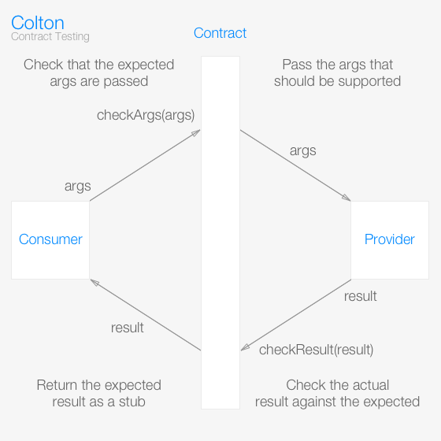

# Colton
Colton is Contract Testing for JavaScript.

```sh
npm install colton
```

## Example
I have an object `Doubler` which is dependent on `Adder` and want to test their relationship with a contract.

```js
// src/index.js
export const Doubler = adder => ({
  double (x) {
    return adder.add(x, x)
  }
})

export const Adder = {
  add (x, y) {
    return x + y
  }
}
```

```js
// test/index.js
import colton, {provide, consume} from 'colton'
const contract = colton({}, {
  add: [{
    args: [24, 24],
    returns: 48
  }]
})

import assert from 'assert'
import {Doubler, Adder} from '../src'
// Doubler test
const adder = provide(contract)
const doubler = Doubler(adder)
assert.strictEqual(doubler.double(24), 48)
// - checks whether adder.add(24, 24) is supported
// - checks doubler.double(24) === 48

// Adder test
consume(contract, Adder)
// - checks adder(24, 24) === 48
```

#### Okay, who cares?
This is a simple example, but we can already see some great properties:

- The contract is completely unaware of both Double and Adder objects
- The contract tests both objects with a single definition
- The contract holds every Doubler-Adder interaction in one place
- The Doubler tests do not depend on the Adder
- The Adder tests do not depend on the Doubler

## Design
### Abstract
I will define "Contract testing" to serve my own purposes here.

Contract testing is testing through contracts. A contract is an interface to which a **provider** must conform and a **consumer** must consume. To conform, a provider must accept a given input and return an expected output. To consume, a consumer must supply a given input to a provider which returns an expected result.

A good contract checks 2 things:

- Is the consumer supplying arguments we have anticipated?
- Is the provider returning the expected result for those arguments?

With that contract we can make some powerful tests.

#### Inspiration
I watched [Integrated Tests Are A Scam](https://www.youtube.com/watch?v=VDfX44fZoMc) by [J.B. Rainsberger](http://www.jbrains.ca/) and completely misunderstood everything he was saying (probably). His proposed solution is that consumers would have "collaboration tests" and the providers would have "contract tests" and the developer would keep these two set of tests in sync. These are superior to integration tests because they:

- Isolate the parts of the system to make it easy to see exactly where in the system a bug has been introduced.
- Run much faster because you aren't using IO in every test, you are using an in-memory mock of your provider.

Colton goes one step further: you write one contract which creates both the collaboration and the contract tests in one unit. This:

- Enforces a strict barrier between consumer and provider
- Ensures contract tests the consumer expects exist on the provider
- Reduces over-specification on the provider when no consumer needs certain functionality
- Eliminates code repetition and human bookkeeping error

#### Visualization
I'm not a fan of proof by picture, but I made one anyway. You can tell this is a legitimate software engineering diagram because it makes a circle.



### Project Goals

- Eliminate duplication across contract tests
- Expose a minimal, intuitive API surface
- Provide clear, concise error messages everywhere

## Documentation
There are only two things to learn: how to use contracts with your test runner and how to define contracts.

### Using contracts with...
Colton is designed to be test runner agnostic, which means Colton should work with Mocha, AVA, Jest, etc. For consumers, contracts work the same way for everybody. For providers, you may pass your test runners test unit (AVA's `test` or Mocha/Jest's `it`).

```js
// for consumers all is same
import {provide, consume} from 'colton'
import myContract from './contract'
const provider = provide(myContract)
// use provider with the consumer ...
// nothing special here

// for providers
import myProvider from '../src/provider'

// if you don't want to use a test runner
consume(myContract, myProvider)

// for AVA, pass in `test`
import test from 'ava'
consume(myContract, myProvider, test)

// for Mocha/Jest pass `it`
// you can place this in any describe you like
consume(myContract, myProvider, it)
```

For any other test runner, supply a function which accepts a string for the test title and the function containing the test to call. That function takes no arguments, so if you want async tests your runner must support tests which return promises. So, tape does not work but blue-tape does. For instance, Jasmine would need:

```js
function promiseIt (title, func) {
  it(title, done => {
    const result = func()
    if (result && typeof result.then === 'function') {
      result.then(() => done(), reason => done(reason))
    } else {
      done()
    }
  })
}
```

### Defining contracts
A contract has two parts: values and methods. Values are simple constants that must be provided by the provider. Methods are the meat. Each method has one or many uses, which are statements of inputs and their corresponding outputs.

```js
import colton from 'colton'
export default colton({
  // values
  maxSize: 100,
  minSize: 10
}, {
  // methods
  getSize: [{
    args: ['earth'],
    returns: 'large'
  }, {
    args: ['average attention span'],
    returns: 'small'
  }]
})
```

| Property | Type | Default | Description |
| -------- | ---- | ------- | ----------- |
| `name` | string | *none* | A label for the use, otherwise its index is used
| `args` | Array | **required** | An array of arguments to match/pass to provider
| `self` | any | `provider` | The `this` the provider method is called with
| `returns` | any | *none* | The value that should be returned
| `throws` | any | *none* | The value that should be thrown
| `resolves` | any | *none* | The value that should be resolved from the resulting promise
| `rejects` | any | *none* | The value that should be rejected from the resulting promise
| `checkArgs` | Function(actualList, expectedList): boolean | `every(===)` | Checks to see if a given set of arguments match the expected args
| `checkResult` | Function(actual, expected): boolean | `===` | Checks to see if a given result matches the expected result

*Note: You cannot have a use case where you have any combination of return, throw, resolve, or reject. You will be reminded by validation.*

Contracts are just JSON (and a special few functions if you need the control, but most of the time you want JSON). This enables cool things with your contracts because they are just data. That cool stuff is up to you (visualization, documentation, automation, higher-order contracts).

## FAQ
#### Why "Colton"?
I name things [after](https://github.com/andrejewski/seth) [my](https://github.com/andrejewski/reem) [friends](https://github.com/andrejewski/matt) [sometimes](https://github.com/andrejewski/paul). Be my friend.

#### How should I organize my contracts?
Colton sets no rules but the suggested way is to have a folder called `test/contracts` and name each file `{consumerName}-{providerName}.js`. Remember a provider can be consumed by multiple consumers.

#### Do I have to write any other kind of test?
Yes. Contract tests are correctness tests so if you care about performance you need different tests too. If you enforce contracts throughout all of your tests there are two considerations: where a consumer is not a provider (i.e. the initial entry points to your code) and when the code is interacting with dependencies you don't own (i.e. black box APIs, network operations, leftpad). For both, try to have adapters (with contracts) in between your code and the unknowns to make the location of the bugs when they are found more clear.

#### Wait, I can still have bugs!?
Contracts are not a silver bullet. We can only check what we have discovered through testing is worth checking. Contracts help when you do have a bug though because a bug represents a place in your contracts that is not well defined. Any fix means one or more contracts and their consumer tests must be written.

#### Does this abstraction have any leaks?
One. That I know of.

Any time you call a provider method from a consumer, there is the potential that Colton will throw an error because the arguments you pass do not match a unique method usage. Which is great, but if you are writing a test which *expects that call to throw and you are not validating the type of error thrown* your consumer code may erroneously pass. To patch this leak, you must do one of the following:

- Use Promises in your provider instead; error values are better than exceptions
- Validate your errors, which you should be doing anyway
- Rule out Colton's errors using `raise(error)` as shown:

```js
import assert from 'assert'
import {provide, raise} from 'colton'
import myContract from '../contract'

const provider = provide(myContract)
assert.throws(() => {
  provider.myPoorlyDefinedMethod()
}, error => {
  raise(error) // only re-throws Colton errors
  return true
})
```

## Contributing
Contributions are incredibly welcome as long as they are standardly applicable and pass the tests (or break bad ones). Tests are written in AVA.

```bash
# running tests
npm run test
```

Follow me on [Twitter](https://twitter.com/compooter) for updates or just for the lolz and please check out my other [repositories](https://github.com/andrejewski) if I have earned it. I thank you for reading.
